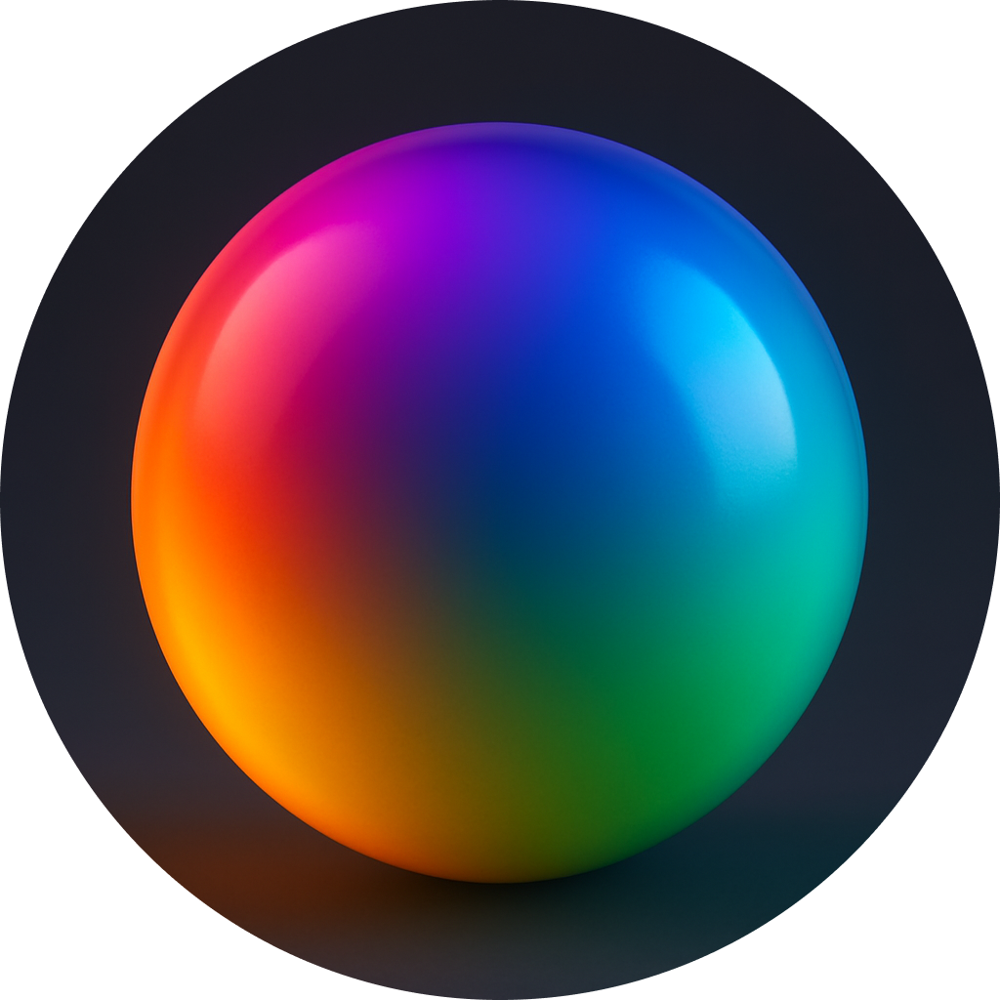

<p align="center">
  <br/>
  <a href="https://duc.ducflair.com" target="_blank"></a>
  <p align="center">Rust Color Parser</p>
  <p align="center" style="align: center;">
    <!-- <a href="https://crates.io/crates/ducflair-duc/"></a>
    <a href="https://github.com/ducflair/duc/releases"></a>
    <a href="https://crates.io/crates/ducflair-duc"></a> -->
    
  </p>
</p>

# bigcolor

**bigcolor** is a comprehensive Rust library for CSS color parsing and manipulation, inspired by [TinyColor](https://github.com/bgrins/TinyColor) with the parsing capabilities of [csscolorparser](https://docs.rs/csscolorparser/latest/csscolorparser/). It provides powerful tools for working with colors in various formats, creating color schemes, and performing color transformations.

Key features include:
- **Extensive format support** for all standard CSS colors
- **Advanced color manipulation** including lighten, darken, rotation and more
- **Color scheme generation** including complementary, triad, tetrad and more
- **Blending modes** similar to those found in graphics software
- **CMYK support** for print-oriented applications
- **Peniko Color** support for renderers
- **CSS gradients support** (Work in Progress)

----

## Supported Color Formats

* [Named colors](https://www.w3.org/TR/css-color-4/#named-colors)
* RGB hexadecimal (with and without `#` prefix)
     + Short format `#rgb`
     + Short format with alpha `#rgba`
     + Long format `#rrggbb`
     + Long format with alpha `#rrggbbaa`
* `rgb()` and `rgba()`
* `hsl()` and `hsla()`
* `hwb()`
* `lab()` (with `lab` feature enabled)
* `color()` (CSS Color 4 color function for different color spaces)
* `cmyk()` and `cmyka()` (not in CSS standard)
* `hwba()`, `hsv()`, `hsva()` (not in CSS standard)

### Example Color Format

<details>
<summary>Click to expand!</summary>

```css
transparent
gold
rebeccapurple
lime
#0f0
#0f0f
#00ff00
#00ff00ff
rgb(0,255,0)
rgb(0% 100% 0%)
rgb(0 255 0 / 100%)
rgba(0,255,0,1)
hsl(120,100%,50%)
hsl(120deg 100% 50%)
hsl(-240 100% 50%)
hsl(-240deg 100% 50%)
hsl(0.3333turn 100% 50%)
hsl(133.333grad 100% 50%)
hsl(2.0944rad 100% 50%)
hsla(120,100%,50%,100%)
hwb(120 0% 0%)
hwb(480deg 0% 0% / 100%)
hsv(120,100%,100%)
hsv(120deg 100% 100% / 100%)
cmyk(100%, 0%, 0%, 0%)
color(srgb 1 0 0)
color(display-p3 1 0.5 0)
color(xyz 0.4124 0.2126 0.0193)
```
</details>

## Usage

Add this to your `Cargo.toml`

```toml
bigcolor = "0.1.0"
```

## Using the BigColor type

```rust
use bigcolor::BigColor;

// Parse any CSS color format
let color = BigColor::parse("#ff0000")?;

// Convert to peniko::Color
let peniko_color = color.to_peniko_color();

// Get contrast color with variable intensity (0.0-1.0)
let contrast = color.get_contrast(0.8); // Higher value means more contrast

// Manipulate colors
let lighter = color.lighten(20);
let darker = color.darken(20);
let desaturated = color.desaturate(50);
let gray = color.grayscale();

// Generate color schemes
let complement = color.complement();
let triad = color.triad();
let tetrad = color.tetrad();
let analogous = color.analogous(5, 30);
let monochromatic = color.monochromatic(5);
let split_complement = color.split_complement();

// Test readability
let background = BigColor::parse("#ffffff")?;
let is_readable = color.is_readable_on(&background, None);
```

## Advanced Features

### CMYK Color Support

```rust
// Create a color from CMYK values
let cyan = BigColor::from_cmyk(1.0, 0.0, 0.0, 0.0);
println!("CMYK string: {}", cyan.to_cmyk_string()); // "cmyk(100%, 0%, 0%, 0%)"

// Convert to CMYK
let red = BigColor::parse("#ff0000")?;
let cmyk = red.to_cmyk(); // Returns [c, m, y, k] values
```

### Blending Modes

```rust
use bigcolor::{BigColor, BlendMode};

let red = BigColor::parse("#ff0000")?;
let blue = BigColor::parse("#0000ff")?;

// Blend with different modes
let multiply = red.blend(&blue, BlendMode::Multiply, 100);
let screen = red.blend(&blue, BlendMode::Screen, 100);
let overlay = red.blend(&blue, BlendMode::Overlay, 100);
let difference = red.blend(&blue, BlendMode::Difference, 100);

// Partial blend (50%)
let partial = red.blend(&blue, BlendMode::Normal, 50);
```

Available blend modes:
- `Normal`: Simple alpha blending
- `Multiply`: Multiplies the colors (darkens)
- `Screen`: Inverts, multiplies, then inverts again (lightens)
- `Overlay`: Combines Multiply and Screen modes
- `Darken`: Selects the darker of the colors
- `Lighten`: Selects the lighter of the colors
- `ColorDodge`: Brightens the base color
- `ColorBurn`: Darkens the base color
- `HardLight`: Similar to Overlay, but with base and blend swapped
- `SoftLight`: Softer version of HardLight
- `Difference`: Subtracts darker from lighter
- `Exclusion`: Similar to Difference but with lower contrast

### Color Interpolation

```rust
use bigcolor::{BigColor, InterpolationSpace};

let yellow = BigColor::parse("#ffff00")?;
let blue = BigColor::parse("#0000ff")?;

// Interpolate in different color spaces
let rgb_mid = yellow.interpolate(&blue, 0.5, InterpolationSpace::RGB);
let hsl_mid = yellow.interpolate(&blue, 0.5, InterpolationSpace::HSL);
let hsv_mid = yellow.interpolate(&blue, 0.5, InterpolationSpace::HSV);

// With lab feature enabled
#[cfg(feature = "lab")]
let lab_mid = yellow.interpolate(&blue, 0.5, InterpolationSpace::LAB);
```

### CSS4 Color Function Support

```rust
// Parse CSS4 color() function
let srgb = BigColor::parse("color(srgb 1 0 0)")?;
let display_p3 = BigColor::parse("color(display-p3 1 0.5 0)")?;
let xyz = BigColor::parse("color(xyz 0.4124 0.2126 0.0193)")?;

// Other supported color spaces: a98-rgb, prophoto-rgb, rec2020, xyz-d50, xyz-d65
```

### LAB Colors (with "lab" feature)

```rust
#[cfg(feature = "lab")]
{
    // Create colors from Lab values
    let lab_color = BigColor::from_laba(50.0, 50.0, 0.0, 1.0);
    
    // Convert to Lab
    let (l, a, b) = some_color.to_lab();
    
    // Get string representation
    println!("Lab string: {}", lab_color.to_lab_string());
}
```

## Features

### Default

* __named-colors__: Enables parsing from [named colors](https://www.w3.org/TR/css-color-4/#named-colors). Requires [`phf`](https://crates.io/crates/phf). Can be disabled using `default-features = false`.

### Optional

* __lab__: Enables parsing `lab()` color format and adds advanced LAB color manipulation.
* __rust-rgb__: Enables converting from [`rgb`](https://crates.io/crates/rgb) crate types into `BigColor`.
* __cint__: Enables converting [`cint`](https://crates.io/crates/cint) crate types to and from `BigColor`.
* __serde__: Enables serializing (into HEX string) and deserializing (from any supported string color format) using [`serde`](https://serde.rs/) framework.

## Similar Projects

* [csscolorparser](https://github.com/mazznoer/csscolorparser) (Go)
* [csscolorparser](https://github.com/deanm/css-color-parser-js) (Javascript)
* [TinyColor](https://github.com/bgrins/TinyColor) (Javascript)

## Gradient Support (Work in Progress)

bigcolor supports CSS gradients, allowing for powerful color manipulation:

```rust
use bigcolor::{SolidColor, Gradient, ColorStop, GradientExtend};

// Create a linear gradient from red to blue
let mut stops = Vec::new();
stops.push(ColorStop::new(SolidColor::new(1.0, 0.0, 0.0, 1.0), 0.0)); // Red at 0%
stops.push(ColorStop::new(SolidColor::new(0.0, 0.0, 1.0, 1.0), 1.0)); // Blue at 100%

let linear_gradient = Gradient::linear(
    stops,
    (0.0, 0.0),
    (1.0, 1.0),
    GradientExtend::Pad,
);

// Create a radial gradient
let mut stops = Vec::new();
stops.push(ColorStop::new(SolidColor::new(1.0, 1.0, 0.0, 1.0), 0.0)); // Yellow at center
stops.push(ColorStop::new(SolidColor::new(1.0, 0.0, 0.0, 1.0), 1.0)); // Red at edge

let radial_gradient = Gradient::radial(
    stops,
    (0.5, 0.5), // center
    0.5,        // radius
    GradientExtend::Pad,
);

// Create a conic gradient
let mut stops = Vec::new();
stops.push(ColorStop::new(SolidColor::new(1.0, 0.0, 0.0, 1.0), 0.0));   // Red at 0°
stops.push(ColorStop::new(SolidColor::new(1.0, 1.0, 0.0, 1.0), 0.33));  // Yellow at 120°
stops.push(ColorStop::new(SolidColor::new(0.0, 0.0, 1.0, 1.0), 0.66));  // Blue at 240°
stops.push(ColorStop::new(SolidColor::new(1.0, 0.0, 0.0, 1.0), 1.0));   // Red at 360°

let conic_gradient = Gradient::conic(
    stops,
    (0.5, 0.5), // center
    0.0,        // start angle
    GradientExtend::Pad,
);

// Parse a CSS gradient string
let css_gradient = "linear-gradient(to right, red, blue)";
let gradient = Gradient::from_css_string(css_gradient).unwrap();

// Get color at a specific position along the gradient (0.0 to 1.0)
let middle_color = gradient.color_at(0.5);
println!("Color at middle: {}", middle_color.to_hex_string());

// Get a complementary gradient
let comp_gradient = gradient.complementary();
```

### Gradient Types

- **Linear Gradients**: Transition colors along a line
- **Radial Gradients**: Transition colors outward from a center point
- **Conic Gradients**: Transition colors around a center point

### Gradient Features

- Create gradients with multiple color stops
- Sample colors at any point along the gradient
- Parse CSS gradient strings (Work in Progress)
- Create complementary gradients
- Integrate with color manipulation features

